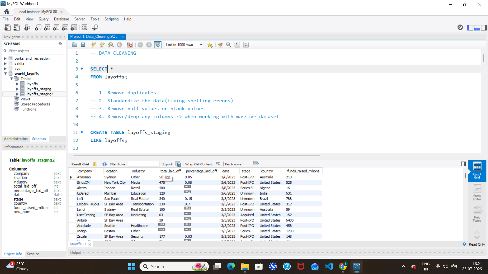
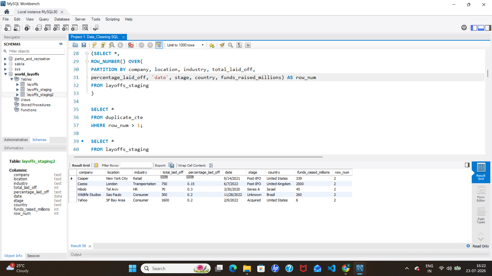
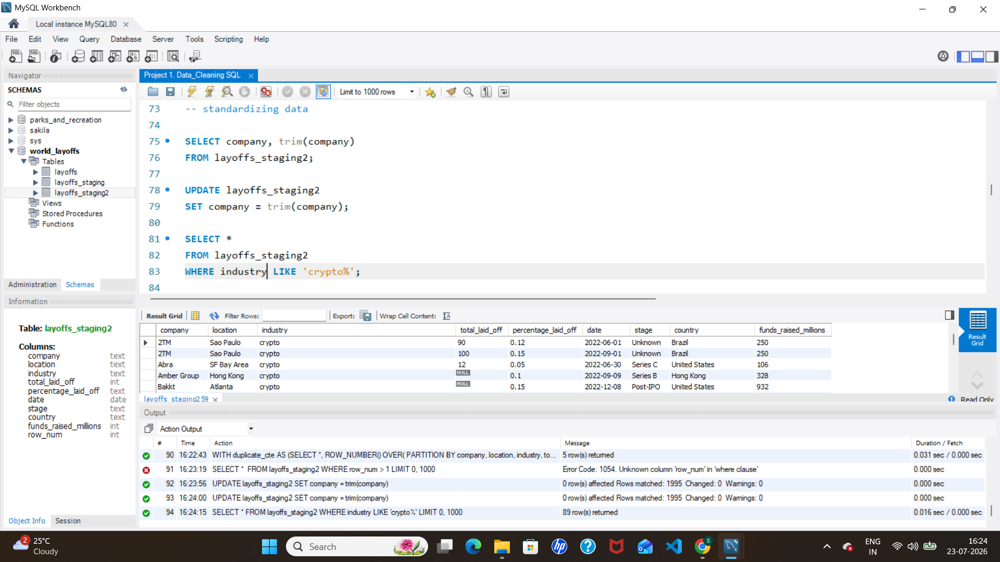
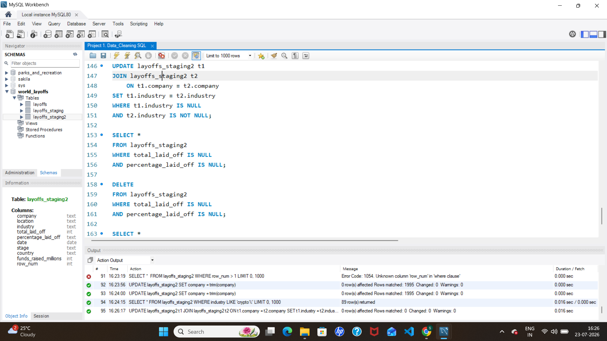
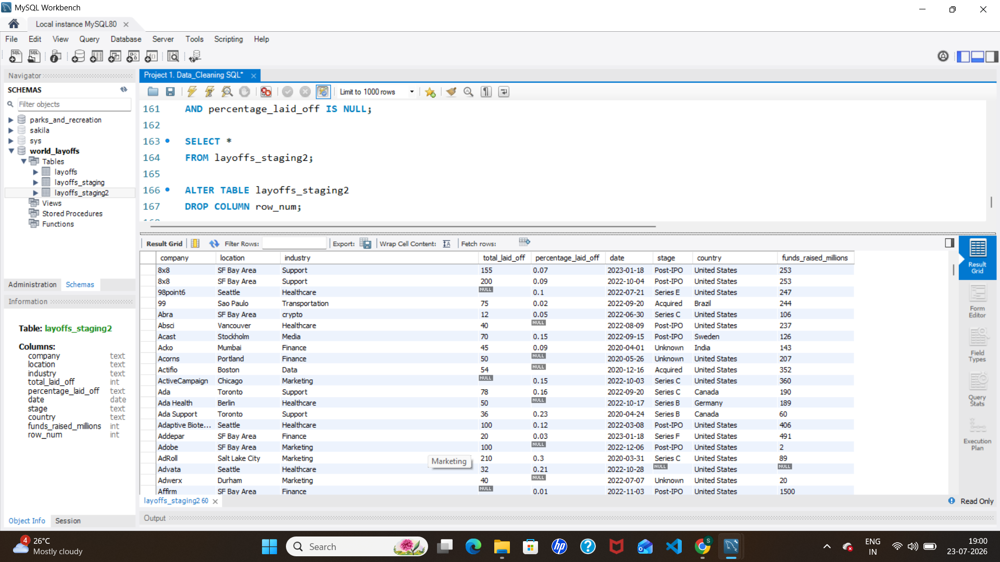

# 🧹 World Layoffs Data Cleaning Using SQL

A SQL project that focuses on cleaning and preparing the **World Layoffs** dataset for analysis. This project demonstrates essential data cleaning techniques using **MySQL**, transforming raw data into a clean and analysis-ready dataset.

---

## 📖 About the Project

Real-world datasets are rarely clean. They often contain duplicate records, inconsistent values, missing information, and incorrect data types.

In this project, I cleaned the World Layoffs dataset using SQL by following a structured data cleaning workflow, making it suitable for future Exploratory Data Analysis (EDA) and business insights.

---

## 🎯 Project Objectives

- Create a staging table to preserve the original dataset
- Identify and remove duplicate records
- Standardize inconsistent text values
- Convert date values into the correct format
- Handle missing and blank values
- Remove unnecessary records
- Prepare a clean dataset for analysis

---

## 🛠️ Tools & Technologies

- MySQL
- MySQL Workbench
- Git
- GitHub

---

## 📂 Dataset

- **Dataset:** World Layoffs
- **Source:** Kaggle
- **Format:** CSV

---

## 🧹 Data Cleaning Workflow

The following steps were performed during the cleaning process:

### ✅ 1. Created a Staging Table
Created a copy of the original dataset to ensure the raw data remained unchanged.

### ✅ 2. Removed Duplicate Records
Used the `ROW_NUMBER()` window function along with Common Table Expressions (CTEs) to identify and remove duplicate rows.

### ✅ 3. Standardized Data
- Trimmed unnecessary spaces
- Fixed inconsistent company and country names
- Standardized text formatting

### ✅ 4. Converted Date Format
Converted the `date` column into MySQL's `DATE` datatype using `STR_TO_DATE()`.

### ✅ 5. Handled Missing Values
- Replaced blank values with `NULL`
- Filled missing `industry` values using self joins
- Removed rows that contained insufficient information

### ✅ 6. Final Data Validation
Verified that the cleaned dataset was consistent and ready for analysis.

---

## 💡 SQL Concepts Used

- CREATE TABLE
- INSERT INTO
- UPDATE
- DELETE
- ALTER TABLE
- CTE (Common Table Expression)
- ROW_NUMBER()
- Window Functions
- PARTITION BY
- SELF JOIN
- TRIM()
- STR_TO_DATE()
- IS NULL
- CASE Statements

---

## 📁 Repository Structure

```
sql-layoffs-data-analysis
│
├── dataset
│   └── layoffs.csv
│
├── sql
│   └── 01_data_cleaning.sql
│
├── screenshots
│   ├── 01_original_dataset.png
│   ├── 02_duplicate_rows.png
│   ├── 03_standardize_data.png
│   ├── 04_handle_missing_values.png
│   └── 05_final_cleaned_dataset.png
│
├── README.md
└── LICENSE
```

---

# 📸 Project Screenshots

## Original Dataset



---

## Identifying Duplicate Records



---

## Standardizing Data



---

## Handling Missing Values



---

## Final Cleaned Dataset



---

## 📈 Results

After completing the cleaning process, the dataset was:

- Free from duplicate records
- Standardized and consistent
- Properly formatted
- Cleaned of unnecessary NULL values
- Ready for Exploratory Data Analysis (EDA)

---

## 🚀 Next Steps

The next phase of this project will include:

- Exploratory Data Analysis (EDA)
- SQL-based business insights
- Trend analysis

---

## 👩‍💻 Author

**Sneha Severiya**

- 🔗 GitHub: https://github.com/snehaseveriya23
- 🔗 LinkedIn: https://www.linkedin.com/in/sneha-severiya-205203376

---

⭐ If you found this project interesting, feel free to star this repository!
